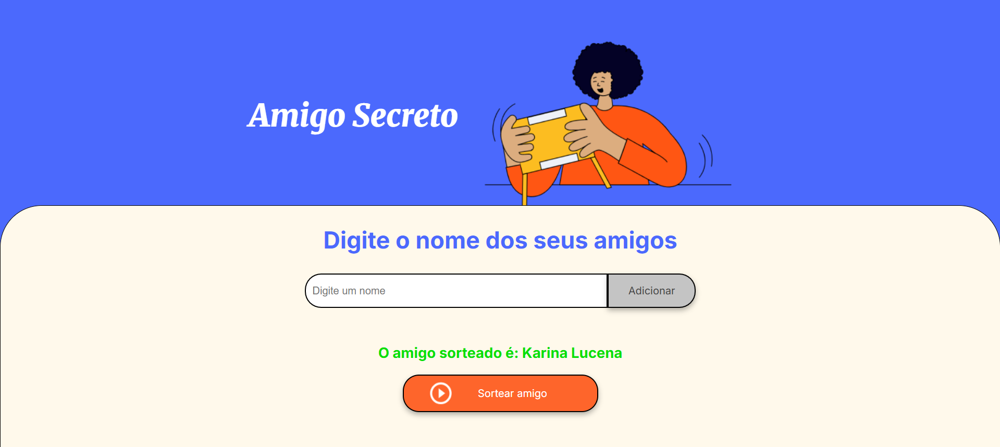

# Amigo Secreto 🎁

## 🎉 Sobre o Projeto

Este é um site simples para sortear um amigo secreto a partir de uma lista de nomes fornecida pelo usuário. O projeto tem como objetivo fortalecer habilidades em lógica de programação e manipulação do DOM com JavaScript.

## 🚀 Funcionalidades

- ✅ Adicionar amigos à lista.
- ✅ Evitar duplicação de nomes.
- ✅ Sortear aleatoriamente um amigo da lista.
- ✅ Limpar a lista após o sorteio.

## 🛠 Tecnologias Utilizadas

- **HTML** para estruturação da página.
- **CSS** para estilização e responsividade.
- **JavaScript** para manipulação da lógica do sorteio.

## 📷 Demonstração

## 👩‍💻 Autora
Desenvolvido por **Karina Lucena** ✨

---
Feito com ❤️ e JavaScript 🚀